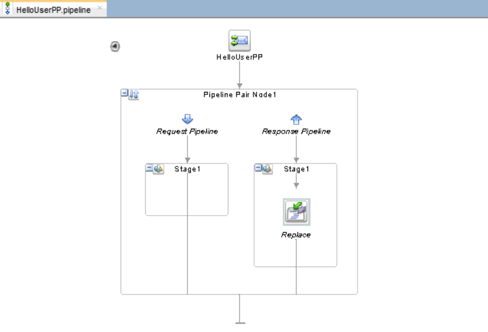
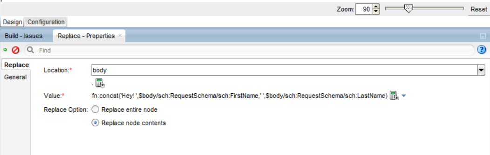
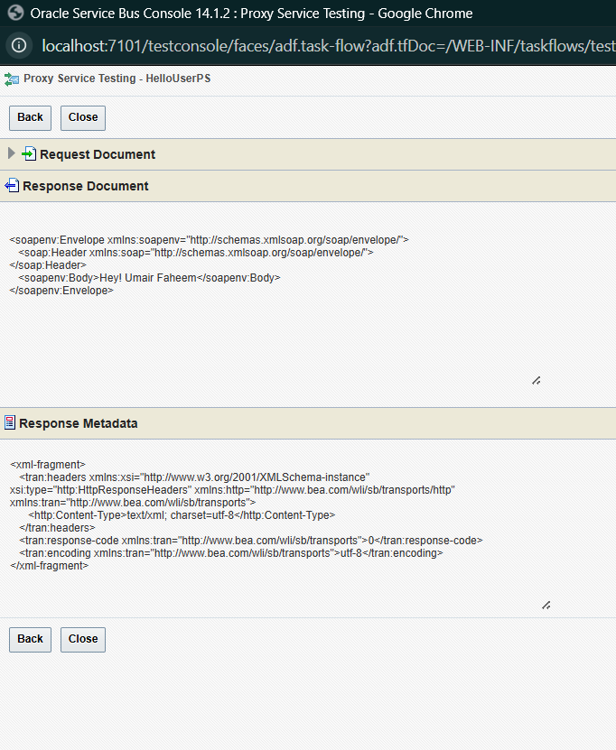

# Project: Hello User

## 📋 Overview

A simple Oracle Service Bus (OSB) project that receives a user's first and last name, then returns a personalized greeting message. This is the foundational project to learn OSB basics: Proxy Services, Pipelines, and message transformation.

**What it does:**  
Input: `FirstName` and `LastName`  
Output: `"Hey! [FirstName] [LastName]"`

---

## 🏗️ Folder Structure

```
SBHelloUser/
│
├── Pipelines/
│   └── HelloUserPP.pipeline          # Pipeline Pair for message processing
│
├── ProxyServices/
│   └── HelloUserPS.proxy             # Exposes the service endpoint
│
├── Schemas/
│   └── hellouser.xsd                 # Defines request/response structure
│
├── WSDLs/
│   └── hellouser.wsdl                # Service contract definition
│
├── pom.xml                           # Maven build configuration
│
└── SBHelloUser.jpr                   # JDeveloper project file
```

---

## 🚀 Implementation Steps

### Step 1: Create Service Bus Application and Project

1. Open **Oracle JDeveloper**
2. File → New → Service Bus Application with Service Bus Project
3. Application Name: `SBHelloUserApp`
4. Project Name: `SBHelloUser`
5. Click **Finish**

---

### Step 2: Create XSD Schema

1. Right-click on **Schemas** folder → New → XML Schema
2. File Name: `hellouser.xsd`
3. Define the schema: take reference from `hellouser.xsd` file

---

### Step 3: Create WSDL Using WSDL Builder

1. Right-click on **WSDLs** folder → New → WSDL (From Schema)
2. Use **WSDL Builder** wizard:
   - WSDL Name: `hellouser.wsdl`
   - Import Schema: Select `hellouser.xsd`
   - Create Port Type with operation: `hellouser`
   - Input Message: `RequestSchema`
   - Output Message: `ResponseSchema`
3. Click **Finish**

---

### Step 4: Create Pipeline

1. Open the **Service Bus Project** canvas (double-click `SBHelloUser.jpr`)
2. From **Component Palette** (right side) → **Service Bus** section
3. Drag **Pipeline** to the **Pipelines/Split Joins** swim lane
4. Configure Pipeline:
   - Service Name: `HelloUserPP` → Next
   - Under Service Type select WSDL: and browse `hellouser.wsdl`
   - On the same step, check the `Expose as a Proxy Service` and name it `HelloUserPS`, browse the location inside ProxyServices folder → Finish

---

### Step 5: Design Pipeline Pair

1. Double click on the Pipeline `HelloUserPP`.
2. Drag **Pipeline Pair** from palette onto the canvas
3. You'll see two sections:
   - **Request Pipeline** (processes incoming message)
   - **Response Pipeline** (processes outgoing response)

---

### Step 6: Add Replace Action

1. From palette, drag **Replace** action into either **Request Pipeline** or **Response Pipeline**
2. Double-click the **Replace** node to configure:

**Configuration:**

| Field                | Value                                                                                                  | Explanation                                                          |
| -------------------- | ------------------------------------------------------------------------------------------------------ | -------------------------------------------------------------------- |
| **Location**         | `body`                                                                                                 | Where in the message to perform replacement (body = message payload) |
| **XPath Expression** | `.`                                                                                                    | Current node (represents entire body element)                        |
| **Value**            | `fn:concat('Hey! ', $body/sch:RequestSchema/sch:FirstName, ' ', $body/sch:RequestSchema/sch:LastName)` | Concatenates "Hey! " with first and last name from request           |
| **Replace Options**  | **Replace Node Content**                                                                               | Replaces the content inside the body node (not the node itself)      |

**Why these values?**

- **`body`**: OSB uses `$body` variable to hold the message payload
- **`.` (dot)**: XPath for "current context" - means we're working with the entire body
- **Replace Node Content**: We want to keep the `<body>` tag but change what's inside it to our greeting

3. Click **OK** to save

---

### Step 7: Create Proxy Service (if not created during Pipeline creation)

1. From **Component Palette**, drag **Proxy Service** to **External Services** swim lane (left side)
2. Name it: `HelloUserPS`
3. Configure Proxy Service:
   - Service Type: **WSDL-based Service**
   - Select WSDL: `hellouser.wsdl`
   - Click **OK**

   > OR just drag the arrow from HelloUserPP to the Proxy Services swim lane

### Step 8: Wire Components (If not dragging from HelloUserPP)

1. Click the small **arrow** on the Proxy Service
2. Drag it to connect to the **Pipeline**
3. A green wire should appear connecting them

**Flow:** `Client → Proxy Service → Pipeline → Response back to Client`

---

### Step 9: Deploy the Project

1. **Start WebLogic Server** (if not running):
   - Right-click on **IntegratedWebLogicServer** in Application Server Navigator
   - Select **Start Server Instance**
   - Wait until you see "Server started in RUNNING mode"

2. **Deploy the Project:**
   - Right-click on **SBHelloUser** project
   - Select **Deploy → SBHelloUser**
   - Select **Deploy to Application Server**
   - Choose server: `IntegratedWebLogicServer`
   - Click **Finish**

3. **Wait for deployment to complete**
   - Check console output for: "Deployment finished"

---

## 🧪 Testing

### Test via Service Bus Console

1. Open browser and navigate to: **[http://localhost:7101/sbconsole](http://localhost:7101/sbconsole)**

2. **Login** with your WebLogic credentials

3. Navigate to deployed project:
   - Click **Project Explorer** (left menu)
   - Expand **SBHelloUser**
   - Click on **HelloUserPS** (Proxy Service) or **HelloUserPipeline**

4. Click the **Play** icon (▶️) next to the service

5. **Test Console** will open:
   - Select operation: `sayHello`
   - In **Payload** section, enter:

     ```xml
     <req:RequestSchema xmlns:req="http://hellouser.example.com">
        <req:FirstName>John</req:FirstName>
        <req:LastName>Doe</req:LastName>
     </req:RequestSchema>
     ```

6. Click **Execute**

7. **Expected Response:**

   ```xml
   <res:ResponseSchema xmlns:res="http://hellouser.example.com">
      <res:Greeting>Hey! John Doe</res:Greeting>
   </res:ResponseSchema>
   ```

---

## 📸 Screenshots

### 1. Pipeline Design


_Pipeline Pair with Replace action configured_

### 2. Replace Action Configuration


_Replace action settings: Location=body, XPath=., Value=concat expression_

### 3. Service Bus Console - Test Interface


_Service Bus Console showing test request and response_

---

## 🐛 Challenges and Issues

**Issue:** "Response Document didn't give desired response"

**Error:** OSB-382513: OSB Replace action failed updating variable "body": [OSB-395105]The TokenIterator does not correspond to a single XmlObject value

**Solution:** Changed Replace option from `Replace entire node` to `Replace node contents`

---

## 🪜 Enhancements for this project

- Add validation to check if FirstName and LastName are provided
- Add error handling for empty inputs

---
