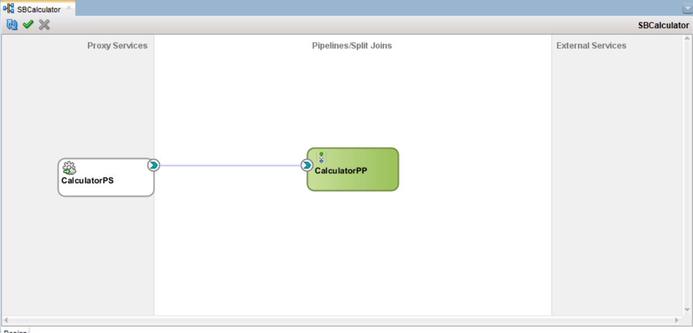
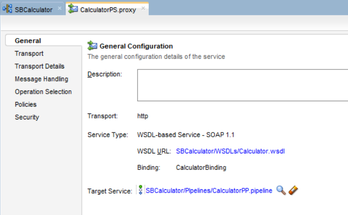
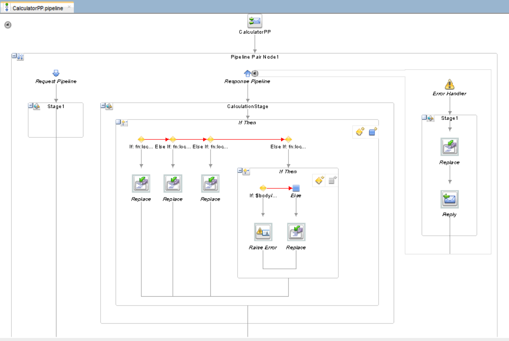
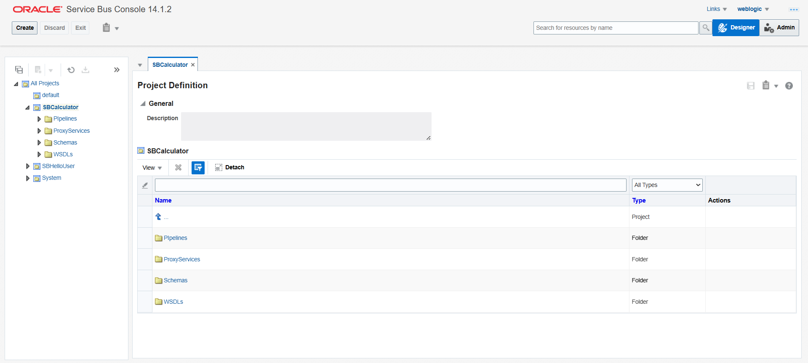

# Project: Calculator Service

## 📋 Overview

A comprehensive Oracle Service Bus (OSB) project that performs four basic mathematical operations: Addition, Subtraction, Multiplication, and Division. The service includes proper error handling, specifically for division by zero scenarios.

**What it does:**  
Input: Two numbers (`Num1` and `Num2`) with operation type  
Output: Calculated result or error message for invalid operations

**Operations Supported:**

- ✅ Addition: `Num1 + Num2`
- ✅ Subtraction: `Num1 - Num2`
- ✅ Multiplication: `Num1 * Num2`
- ✅ Division: `Num1 ÷ Num2` (with division by zero protection)

---

## 🏗️ Folder Structure

```
SBCalculator/
│
├── Pipelines/
│   └── CalculatorPP.pipeline              # Main pipeline for logic
│
├── ProxyServices/
│   └── CalculatorPS.proxy                 # Service endpoint
│
├── Schemas/
│   └── CalculatorSchema.xsd               # Request/Response/Fault structures
│
├── WSDLs/
│   └── Calculator.wsdl                    # Service contract
│
└── SBCalculator.jpr                       # JDeveloper project file
```

---

## 🚀 Implementation Steps

### Step 1: Create Service Bus Application and Project

1. Open **Oracle JDeveloper**
2. File → New → **Service Bus Application with Service Bus Project**
3. **Application Name:** `CalculatorApp`
4. **Project Name:** `SBCalculator`
5. Click **Finish**

**Result:** Project structure created with folders for Proxy Services, Pipelines, Schemas, and WSDLs

---

### Step 2: Create XSD Schema

1. Right-click on **Schemas** folder → New → **XML Schema**
2. **File Name:** `CalculatorSchema.xsd`
3. Define the schema with request/response structures for all operations: Take reference from CalculatorSchema.xsd in this repo
4. **Save** the file

**Schema includes:**

- 4 Request types (one for each operation)
- 4 Response types (one for each operation)
- 1 Fault type (for error handling)

---

### Step 3: Create WSDL

1. Right-click on **WSDLs** folder → New → **WSDL Document**
2. **File Name:** `Calculator.wsdl`
3. Define the WSDL with all operations: Take reference from Calculator.wsdl in this repo
4. **Save** the file

---

### Step 4: Create Pipeline Pair and Proxy Service

1. Open the **Service Bus Project** canvas (double-click `SBCalculator.jpr`)
2. From **Component Palette** (right side) → **Service Bus** section
3. Drag **Pipeline Pair** to the **Pipelines/Split Joins** swim lane
4. Configure Pipeline Pair:
   - **Pipeline Pair Name:** `CalculatorPP`
   - Click **Next**
   - **Service Type:** Select **WSDL**
   - Browse and select `Calculator.wsdl`
   - Check **Expose as a Proxy Service**
   - **Proxy Service Name:** `CalculatorPS`
   - **Location:** Browse to ProxyServices folder
   - Click **Finish**

**Result:** Pipeline Pair and Proxy Service created and connected automatically

---

### Step 5: Design Pipeline Structure

1. **Double-click** on `CalculatorPP` to open the pipeline editor
2. You'll see:
   - **Request Pipeline** (left side - empty)
   - **Response Pipeline** (right side - empty)

3. In **Response Pipeline**, drag a **Stage** component from the palette
   - **Stage Name:** `CalculationStage`
   - Click **OK**

4. Drag **Error Handler** component into the **Response Pipeline**
   - This will automatically create a Stage inside it for error handling

**Pipeline Structure:**

```
CalculatorPP
├── Request Pipeline (passthrough)
└── Response Pipeline
    ├── Error Handler (with Stage)
    └── CalculationStage
```

---

### Step 6: Add Conditional Logic (IfThen)

1. **Double-click** or expand `CalculationStage`
2. From Component Palette, drag **IfThen** flow control into the stage
3. Configure **IfThen** with 4 conditions:

**Condition 1 - Addition:**

```xpath
fn:local-name($body/*) = 'AddRequest'
```

**Condition 2 - Subtraction:**

```xpath
fn:local-name($body/*) = 'SubtractRequest'
```

**Condition 3 - Multiplication:**

```xpath
fn:local-name($body/*) = 'MultiplyRequest'
```

**Condition 4 - Division:**

```xpath
fn:local-name($body/*) = 'DivideRequest'
```

**What this does:**

- Checks which type of request came in (Add, Subtract, Multiply, or Divide)
- Routes to appropriate calculation logic based on operation type
- `fn:local-name()` = Get element name without namespace prefix
  - This makes our IfThen conditions namespace-independent and much simpler to write!

---

### Step 7: Calculation Logic - Addition

1. Click on the **"Then"** section of the AddRequest condition
2. Drag **Replace** activity into this section
3. **Double-click** the Replace activity to configure:

   **Configuration:**

   | Field           | Value               |
   | --------------- | ------------------- |
   | **In Variable** | `body`              |
   | **XPath**       | `*[1]`              |
   | **Replace**     | Replace entire node |
   | **Expression**  | See below           |

   **Expression:**

   ```xml
   <sch:AddResponse xmlns:sch="http://practice.learning.com/osb/calculator/schema">
       <sch:result>{$body/sch:AddRequest/sch:Num1 + $body/sch:AddRequest/sch:Num2}</sch:result>
   </sch:AddResponse>
   ```

**What it does:**

- Extracts Num1 and Num2 from the request
- Adds them together
- Creates AddResponse with the result

---

### Step 8: Calculation Logic - Subtraction

1. Click on the **"Then"** section of the SubtractRequest condition
2. Drag **Replace** activity
3. Configure:

   | Field           | Value               |
   | --------------- | ------------------- |
   | **In Variable** | `body`              |
   | **XPath**       | `*[1]`              |
   | **Replace**     | Replace entire node |
   | **Expression**  | See below           |

   **Expression:**

   ```xml
   <sch:SubtractResponse xmlns:sch="http://practice.learning.com/osb/calculator/schema">
       <sch:result>{$body/sch:SubtractRequest/sch:Num1 - $body/sch:SubtractRequest/sch:Num2}</sch:result>
   </sch:SubtractResponse>
   ```

---

### Step 9: Calculation Logic - Multiplication

1. Click on the **"Then"** section of the MultiplyRequest condition
2. Drag **Replace** activity
3. Configure:

   | Field           | Value               |
   | --------------- | ------------------- |
   | **In Variable** | `body`              |
   | **XPath**       | `*[1]`              |
   | **Replace**     | Replace entire node |
   | **Expression**  | See below           |

   **Expression:**

   ```xml
   <sch:MultiplyResponse xmlns:sch="http://practice.learning.com/osb/calculator/schema">
       <sch:result>{$body/sch:MultiplyRequest/sch:Num1 * $body/sch:MultiplyRequest/sch:Num2}</sch:result>
   </sch:MultiplyResponse>
   ```

---

### Step 10: Division Logic with Error Handling

This is the most complex operation because we need to check for division by zero.

1. Click on the **"Then"** section of the DivideRequest condition
2. Drag **IfThen** (nested) into this section
3. Configure the nested IfThen condition:
   **Nested Condition:**

   ```xpath
   $body/sch:DivideRequest/sch:Num2 = 0
   ```

4. **In the nested "Then" section** (when Num2 = 0):
   - Drag **Raise Error** activity 5. Configure:
     - **Error Code:** `DIVISION_BY_ZERO`
     - **Error Message:** `Cannot divide by zero`

5. **In the nested "Else" section** (when Num2 ≠ 0): 6. Drag **Replace** activity 7. Configure:

   | Field           | Value               |
   | --------------- | ------------------- |
   | **In Variable** | `body`              |
   | **XPath**       | `*[1]`              |
   | **Replace**     | Replace entire node |
   | **Expression**  | See below           |

   **Expression:**

   ```xml
   <sch:DivideResponse xmlns:sch="http://practice.learning.com/osb/calculator/schema">
       <sch:result>{$body/sch:DivideRequest/sch:Num1 div $body/sch:DivideRequest/sch:Num2}</sch:result>
   </sch:DivideResponse>
   ```

**⚠️ Important:** Use `div` operator (not `/`) for division in XPath

**Division Logic Flow:**

```
Is Num2 = 0?
├── YES → Raise Error (DIVISION_BY_ZERO)
└── NO  → Calculate and return result
```

---

### Step 11: Configure Error Handler

1. Navigate to **Error Handler** in the Response Pipeline
2. Open the **Stage** inside Error Handler
3. Drag **Replace** activity into the stage
4. Configure:

   | Field           | Value               |
   | --------------- | ------------------- |
   | **In Variable** | `body`              |
   | **XPath**       | `*[1]`              |
   | **Replace**     | Replace entire node |
   | **Expression**  | See below           |

   **Expression:**

   ```xml
   <sch:CalculatorFault xmlns:sch="http://practice.learning.com/osb/calculator/schema">
       <sch:errorCode>{data($fault/ctx:errorCode)}</sch:errorCode>
       <sch:errorMessage>{data($fault/ctx:reason)}</sch:errorMessage>
   </sch:CalculatorFault>
   ```

5. Drag **Reply** activity below the Replace
6. Configure Reply:
   - Select **Reply with Failure** (if available)

**What this does:**

- Catches errors raised by Raise Error activity
- Extracts error code and message from $fault context
- Formats them into CalculatorFault XML structure
- Sends fault response back to client

---

### Step 12: Deploy the Project

1. **Save All** files (Ctrl + Shift + S)

2. **Start WebLogic Server** (if not running):
   - Right-click on your server in Application Server Navigator
   - Select **Start Server Instance**
   - Wait for "Server started in RUNNING mode"

3. **Deploy the Project:**
   - Right-click on **SBCalculator**
   - Select **Deploy → SBCalculator**
   - Select **Deploy to Application Server**
   - Choose your OSB server
   - Click **Finish**

4. **Wait for deployment to complete**
   - Check console for "Deployment finished successfully"

---

## 🧪 Testing

### Test via Service Bus Console

1. Open browser and navigate to: **http://localhost:7101/sbconsole**
2. **Login** with WebLogic credentials
3. Navigate to:
   - **Project Explorer** → **SBCalculator** → **Proxy Services** → **CalculatorPS**
4. Click **Launch Test Console** button

---

### Test Case 1: Addition

**Operation:** Select `Add`

**Request Payload:**

```xml
<sch:AddRequest xmlns:sch="http://practice.learning.com/osb/calculator/schema">
    <sch:Num1>100</sch:Num1>
    <sch:Num2>50</sch:Num2>
</sch:AddRequest>
```

**Expected Response:**

```xml
<sch:AddResponse xmlns:sch="http://practice.learning.com/osb/calculator/schema">
    <sch:result>150</sch:result>
</sch:AddResponse>
```

✅ **Result:** 100 + 50 = 150

---

### Test Case 2: Subtraction

**Operation:** Select `Subtract`

**Request Payload:**

```xml
<sch:SubtractRequest xmlns:sch="http://practice.learning.com/osb/calculator/schema">
    <sch:Num1>100</sch:Num1>
    <sch:Num2>30</sch:Num2>
</sch:SubtractRequest>
```

**Expected Response:**

```xml
<sch:SubtractResponse xmlns:sch="http://practice.learning.com/osb/calculator/schema">
    <sch:result>70</sch:result>
</sch:SubtractResponse>
```

✅ **Result:** 100 - 30 = 70

---

### Test Case 3: Multiplication

**Operation:** Select `Multiply`

**Request Payload:**

```xml
<sch:MultiplyRequest xmlns:sch="http://practice.learning.com/osb/calculator/schema">
    <sch:Num1>12</sch:Num1>
    <sch:Num2>5</sch:Num2>
</sch:MultiplyRequest>
```

**Expected Response:**

```xml
<sch:MultiplyResponse xmlns:sch="http://practice.learning.com/osb/calculator/schema">
    <sch:result>60</sch:result>
</sch:MultiplyResponse>
```

✅ **Result:** 12 × 5 = 60

---

### Test Case 4: Division (Valid)

**Operation:** Select `Divide`

**Request Payload:**

```xml
<sch:DivideRequest xmlns:sch="http://practice.learning.com/osb/calculator/schema">
    <sch:Num1>100</sch:Num1>
    <sch:Num2>4</sch:Num2>
</sch:DivideRequest>
```

**Expected Response:**

```xml
<sch:DivideResponse xmlns:sch="http://practice.learning.com/osb/calculator/schema">
    <sch:result>25</sch:result>
</sch:DivideResponse>
```

✅ **Result:** 100 ÷ 4 = 25

---

### Test Case 5: Division by Zero (Error Case)

**Operation:** Select `Divide`

**Request Payload:**

```xml
<sch:DivideRequest xmlns:sch="http://practice.learning.com/osb/calculator/schema">
    <sch:Num1>100</sch:Num1>
    <sch:Num2>0</sch:Num2>
</sch:DivideRequest>
```

**Expected Response (SOAP Fault):**

```xml
<soapenv:Envelope xmlns:soapenv="http://schemas.xmlsoap.org/soap/envelope/">
   <soapenv:Body>
      <soapenv:Fault>
         <faultcode>...</faultcode>
         <faultstring>...</faultstring>
         <detail>
            <sch:CalculatorFault xmlns:sch="http://practice.learning.com/osb/calculator/schema">
               <sch:errorCode>DIVISION_BY_ZERO</sch:errorCode>
               <sch:errorMessage>Cannot divide by zero</sch:errorMessage>
            </sch:CalculatorFault>
         </detail>
      </soapenv:Fault>
   </soapenv:Body>
</soapenv:Envelope>
```

✅ **Result:** Proper fault response with error details

---

## 📸 Screenshots

### 1. JDeveloper Project File



### 2. Proxy Service



### 3. Pipeline



### 4. Service Bus Console



## 🐛 Challenges and Issues

### Issue 1: Namespace Mismatch Error

**Error:**

```
OSB-382040: Failed to set the value of context variable "body".
Value must be an instance of {http://schemas.xmlsoap.org/soap/envelope/}Body.
```

**Cause:**

- Incorrect namespace used in Replace expressions
- Mismatch between XSD targetNamespace and expression namespace

**Solution:**

- Ensured all Replace expressions use the correct namespace: `http://practice.learning.com/osb/calculator/schema`
- Changed namespace prefix from `cal` to `sch` to match actual schema
- Verified element names match case-sensitivity (Num1 not num1)

---

### Issue 2: XPath Location Configuration

**Error:** Initial Replace configuration didn't work correctly

**Solution:**

- Changed **XPath** from `.` to `*[1]`
- This selects the first child element of body (the request element)
- Kept **Replace** option as "Replace entire node"

---

### Issue 3: Division Operator

**Issue:** Using `/` for division in XPath caused parsing errors

**Solution:**

- Changed to `div` operator which is the correct XPath division operator
- Example: `$body/sch:DivideRequest/sch:Num1 div $body/sch:DivideRequest/sch:Num2`

---

## 🪜 Enhancements for this project

- Add validation for null/empty inputs
- Support for more operations (power, square root, modulo)
- Support for multiple number inputs (array of numbers)

---
