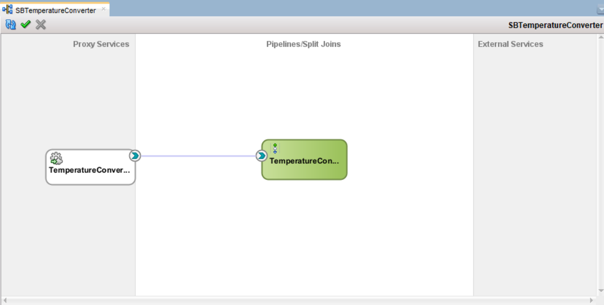
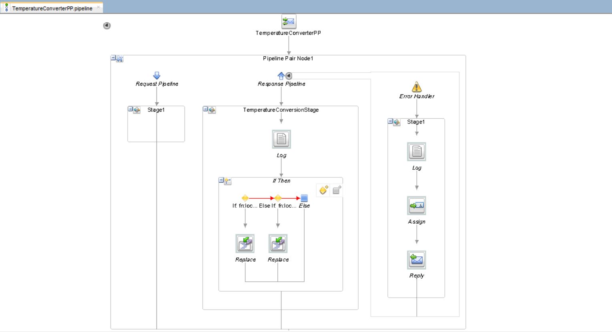
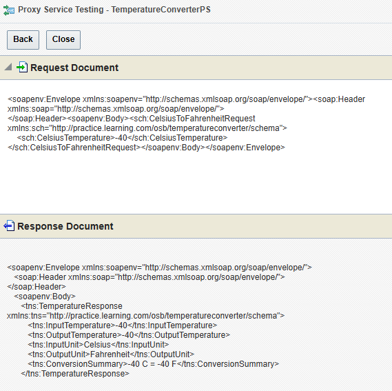

# Project: Temperature Converter

## 📋 Overview

An Oracle Service Bus (OSB) project that receives a temperature value and converts it between Celsius and Fahrenheit. This project covers core OSB concepts — Proxy Services, Pipelines, XPath Transformations, and Fault Handling — with two distinct WSDL operations exposed to the client.

**What it does:**  
Input: A temperature value  
Output: Converted temperature with unit labels and a human-readable summary

| Operation                    | Input                             | Output                               |
| ---------------------------- | --------------------------------- | ------------------------------------ |
| `convertCelsiusToFahrenheit` | `CelsiusTemperature` (decimal)    | `TemperatureResponse` with °F result |
| `convertFahrenheitToCelsius` | `FahrenheitTemperature` (decimal) | `TemperatureResponse` with °C result |

> **Note:** No Business Service is used. All transformation logic is self-contained within the Pipeline using XPath expressions. A Business Service is only needed when OSB forwards requests to an external backend system.

---

## 🏗️ Folder Structure

```
SBTemperatureConverter/
│
├── Pipelines/
│   └── TemperatureConverterPP.pipeline     # Pipeline with transformation logic
│
├── ProxyServices/
│   └── TemperatureConverterPS.proxy        # Exposes the SOAP endpoint to clients
│
├── Schemas/
│   └── TemperatureConverter.xsd            # Defines request, response and fault elements
│
├── WSDLs/
│   └── TemperatureConverter.wsdl           # Service contract with 2 operations
│
├── pom.xml                                 # Maven build configuration
│
└── SBTemperatureConverter.jpr              # JDeveloper project file
```

---

## 🚀 Implementation Steps

### Step 1: Create Service Bus Application and Project

1. Open **Oracle JDeveloper**
2. File → New → **Service Bus Application with Service Bus Project**
3. Application Name: `SBTemperatureConverterApp`
4. Project Name: `SBTemperatureConverter`
5. Click **Finish**

---

### Step 2: Create XSD Schema

1. Right-click on **Schemas** folder → New → **XML Schema**
2. File Name: `TemperatureConverter.xsd`
3. Open in **Source view** and define the following elements:
   - `CelsiusToFahrenheitRequest` — contains `CelsiusTemperature` (`xsd:decimal`)
   - `FahrenheitToCelsiusRequest` — contains `FahrenheitTemperature` (`xsd:decimal`)
   - `TemperatureResponse` — contains `InputTemperature`, `OutputTemperature`, `InputUnit`, `OutputUnit`, `ConversionSummary`
   - `TemperatureFault` — contains `ErrorCode`, `ErrorMessage`, `FaultyValue`
4. Set `targetNamespace` to: `http://practice.learning.com/osb/temperatureconverter/schema`
5. Set `elementFormDefault="qualified"`

> Take reference from the `TemperatureConverter.xsd` file in the Schemas folder.

---

### Step 3: Create WSDL

1. Right-click on **WSDLs** folder → New → **WSDL Document**
2. File Name: `TemperatureConverter.wsdl`
3. Open in **Source view** and configure:
   - Import the XSD schema using `<xsd:import>`
   - Define 4 messages: `CelsiusToFahrenheitRequestMsg`, `FahrenheitToCelsiusRequestMsg`, `TemperatureResponseMsg`, `TemperatureFaultMsg`
   - Define `TemperatureConverterPortType` with 2 operations, each with input, output, and fault
   - Add `document/literal` SOAP binding
   - Add `<service>` block with `soap:address` (required by OSB)
4. Set `targetNamespace` to: `http://practice.learning.com/osb/temperatureconverter/wsdl`

> Take reference from the `TemperatureConverter.wsdl` file in the WSDLs folder.

---

### Step 4: Create Pipeline

1. Open the **Service Bus Project** canvas (double-click `SBTemperatureConverter.jpr`)
2. From **Component Palette** → drag **Pipeline** into the **Pipelines/Split Joins** swim lane
3. Configure the Pipeline wizard:
   - Service Name: `TemperatureConverterPP`
   - Service Type: **WSDL Based Service** → browse and select `TemperatureConverter.wsdl`
   - Port: `TemperatureConverterPort`
   - **Uncheck** `Expose as Proxy Service` — we create the Proxy Service manually in Step 6
4. Click **Finish**

---

### Step 5: Design Pipeline Logic

1. Double-click `TemperatureConverterPP` to open the Pipeline editor
2. Drag a **Pipeline Pair** from the palette onto the canvas — this creates:
   - **Request Pipeline** — where transformation logic will live
   - **Response Pipeline** — leave empty for this project

#### 5.1 Add Stage to Request Pipeline

1. Click inside the **Request Pipeline**
2. Drag a **Stage** node into it
3. Name it: `TemperatureConversionStage`

#### 5.2 Add Log Node (Diagnostic)

1. Inside `TemperatureConversionStage`, drag a **Log** node
2. Configure:
   - **Severity:** Info
   - **Expression:**
     ```xpath
     fn:concat('Incoming operation element: ', fn:local-name($body/*[1]))
     ```

#### 5.3 Add If Then Node

1. Inside `TemperatureConversionStage` (after Log), drag an **If Then** node
2. This creates **If**, **Else If**, and **Else** branches

**If condition:**

```xpath
fn:local-name($body/*[1]) = 'CelsiusToFahrenheitRequest'
```

**Else If condition:**

```xpath
fn:local-name($body/*[1]) = 'FahrenheitToCelsiusRequest'
```

**Else:** Leave empty

> ⚠️ **Critical:** The condition must check the **XSD element name** (`CelsiusToFahrenheitRequest`), NOT the WSDL operation name (`convertCelsiusToFahrenheit`). These are different and confusing them will cause the condition to silently never match.

#### 5.4 Add Replace Node — Celsius to Fahrenheit (If branch)

1. Drag a **Replace** node inside the **If** branch
2. Configure:

| Field              | Value                |
| ------------------ | -------------------- |
| **In Variable**    | `body`               |
| **XPath**          | `*[1]`               |
| **Replace Option** | Replace Entire Node  |
| **Value**          | See expression below |

**Expression (enter in Expression Builder):**

```xpath
<tns:TemperatureResponse
    xmlns:tns="http://practice.learning.com/osb/temperatureconverter/schema">
    <tns:InputTemperature>
        {$body/*[1]/*[1]/text()}
    </tns:InputTemperature>
    <tns:OutputTemperature>
        {($body/*[1]/*[1] * 9 div 5) + 32}
    </tns:OutputTemperature>
    <tns:InputUnit>Celsius</tns:InputUnit>
    <tns:OutputUnit>Fahrenheit</tns:OutputUnit>
    <tns:ConversionSummary>
        {fn:concat(
            string($body/*[1]/*[1]),
            ' C = ',
            string(($body/*[1]/*[1] * 9 div 5) + 32),
            ' F'
        )}
    </tns:ConversionSummary>
</tns:TemperatureResponse>
```

#### 5.5 Add Replace Node — Fahrenheit to Celsius (Else If branch)

1. Drag a **Replace** node inside the **Else If** branch
2. Configure with same settings as above

**Expression:**

```xpath
<tns:TemperatureResponse
    xmlns:tns="http://practice.learning.com/osb/temperatureconverter/schema">
    <tns:InputTemperature>
        {$body/*[1]/*[1]/text()}
    </tns:InputTemperature>
    <tns:OutputTemperature>
        {($body/*[1]/*[1] - 32) * 5 div 9}
    </tns:OutputTemperature>
    <tns:InputUnit>Fahrenheit</tns:InputUnit>
    <tns:OutputUnit>Celsius</tns:OutputUnit>
    <tns:ConversionSummary>
        {fn:concat(
            string($body/*[1]/*[1]),
            ' F = ',
            string(($body/*[1]/*[1] - 32) * 5 div 9),
            ' C'
        )}
    </tns:ConversionSummary>
</tns:TemperatureResponse>
```

#### 5.6 Add Pipeline Error Handler

> ⚠️ **Placement is critical.** The Error Handler must be attached to the **Pipeline Pair node itself** — NOT dragged into the Request Pipeline or Response Pipeline lanes. If placed inside either pipeline lane it will not function as a fault handler.

**How to attach it correctly:**

1. In the Pipeline editor, click on the **Pipeline Pair** node header/border to select the entire Pipeline Pair (not the Request or Response lane inside it)
2. Right-click the **Pipeline Pair** node → select **Add Error Handler**
3. A separate **Error Handler lane** appears as a sibling — not nested inside Request or Response Pipeline
4. Inside it, drag these 3 nodes in order:

**Log Node:**

- Severity: `Error`
- Expression:

```xpath
fn:concat(
    'ERROR in TemperatureConverter | ',
    'Reason: ', string($fault/*[local-name()='reason']),
    ' | Operation: ', fn:local-name($body/*[1])
)
```

**Assign Node:**

- Variable: `body`
- Expression:

```xpath
<soap:Envelope
    xmlns:soap="http://schemas.xmlsoap.org/soap/envelope/"
    xmlns:tns="http://practice.learning.com/osb/temperatureconverter/schema">
    <soap:Body>
        <soap:Fault>
            <faultcode>soap:Client</faultcode>
            <faultstring>Temperature Conversion Failed</faultstring>
            <detail>
                <tns:TemperatureFault>
                    <tns:ErrorCode>
                        {
                            if (string($fault/*[local-name()='errorCode']) != '')
                            then string($fault/*[local-name()='errorCode'])
                            else 'CONVERSION_ERROR'
                        }
                    </tns:ErrorCode>
                    <tns:ErrorMessage>
                        {
                            if (string($fault/*[local-name()='reason']) != '')
                            then string($fault/*[local-name()='reason'])
                            else 'An error occurred during temperature conversion'
                        }
                    </tns:ErrorMessage>
                    <tns:FaultyValue>
                        {
                            if ($body/*[local-name()='CelsiusToFahrenheitRequest'])
                            then string($body/*[local-name()='CelsiusToFahrenheitRequest']/*[1])
                            else if ($body/*[local-name()='FahrenheitToCelsiusRequest'])
                            then string($body/*[local-name()='FahrenheitToCelsiusRequest']/*[1])
                            else 'Unknown - body may be malformed'
                        }
                    </tns:FaultyValue>
                </tns:TemperatureFault>
            </detail>
        </soap:Fault>
    </soap:Body>
</soap:Envelope>
```

**Reply Node:**

- Option: **Reply With Failure**

---

### Step 6: Create Proxy Service

1. From **Component Palette**, drag **Proxy Service** into the **Proxy Services** swim lane (left column)
2. Configure the wizard:
   - Service Name: `TemperatureConverterPS`
   - Service Type: **WSDL Based Service** → browse and select `TemperatureConverter.wsdl`
   - Port: `TemperatureConverterPort`
   - Transport: `HTTP`
   - Endpoint URI: `/TemperatureConverter`
3. Click **Finish**

---

### Step 7: Wire Proxy Service to Pipeline

1. On the main canvas, hover over `TemperatureConverterPS`
2. A **yellow connector arrow** appears on its right edge
3. Click and drag it across to `TemperatureConverterPP`
4. Release — a connection line appears

---

### Step 8: Deploy the Project

1. **Start WebLogic Server** (if not running):
   - Right-click on **IntegratedWebLogicServer** in Application Server Navigator
   - Select **Start Server Instance**
   - Wait until you see `Server started in RUNNING mode`

2. **Deploy the Project:**
   - Right-click on **SBTemperatureConverter** project
   - Select **Deploy → SBTemperatureConverter**
   - Select **Deploy to Application Server**
   - Choose server: `IntegratedWebLogicServer`
   - Click **Finish**

3. **Confirm deployment:**
   - Watch the console output for: `Deployment finished`
   - No validation errors should appear

---

## 🧪 Testing

### Test via Service Bus Console

1. Open browser and navigate to: **http://localhost:7101/sbconsole**
2. **Login** with WebLogic credentials
3. Navigate to:
   - **Project Explorer** → **SBTemperatureConverter** → **Proxy Services** → **TemperatureConverterPS**
4. Click **Launch Test Console** button

---

#### ✅ Test 1 — Celsius to Fahrenheit (100°C → 212°F)

**Request:**

```xml
    <soapenv:Body>
        <sch:CelsiusToFahrenheitRequest>
            <sch:CelsiusTemperature>100</sch:CelsiusTemperature>
        </sch:CelsiusToFahrenheitRequest>
    </soapenv:Body>
```

**Expected Response:**

```xml
<sch:TemperatureResponse>
    <sch:InputTemperature>100</sch:InputTemperature>
    <sch:OutputTemperature>212</sch:OutputTemperature>
    <sch:InputUnit>Celsius</sch:InputUnit>
    <sch:OutputUnit>Fahrenheit</sch:OutputUnit>
    <sch:ConversionSummary>100 C = 212 F</sch:ConversionSummary>
</sch:TemperatureResponse>
```

---

#### ✅ Test 2 — Fahrenheit to Celsius (32°F → 0°C)

**Request:**

```xml
    <soapenv:Body>
        <sch:FahrenheitToCelsiusRequest>
            <sch:FahrenheitTemperature>32</sch:FahrenheitTemperature>
        </sch:FahrenheitToCelsiusRequest>
    </soapenv:Body>
```

**Expected Response:**

```xml
<sch:TemperatureResponse>
    <sch:InputTemperature>32</sch:InputTemperature>
    <sch:OutputTemperature>0</sch:OutputTemperature>
    <sch:InputUnit>Fahrenheit</sch:InputUnit>
    <sch:OutputUnit>Celsius</sch:OutputUnit>
    <sch:ConversionSummary>32 F = 0 C</sch:ConversionSummary>
</sch:TemperatureResponse>
```

---

#### ✅ Test 3 — Decimal input (37.6°C → 99.68°F)

**Request:**

```xml
    <soapenv:Body>
        <sch:CelsiusToFahrenheitRequest>
            <sch:CelsiusTemperature>37.6</sch:CelsiusTemperature>
        </sch:CelsiusToFahrenheitRequest>
    </soapenv:Body>
```

**Expected Response:**

```xml
<sch:TemperatureResponse>
    <sch:InputTemperature>37.6</sch:InputTemperature>
    <sch:OutputTemperature>99.68</sch:OutputTemperature>
    <sch:InputUnit>Celsius</sch:InputUnit>
    <sch:OutputUnit>Fahrenheit</sch:OutputUnit>
    <sch:ConversionSummary>37.6 C = 99.68 F</sch:ConversionSummary>
</sch:TemperatureResponse>
```

---

#### ✅ Test 4 — Edge case: -40°C = -40°F (equal point)

**Request:**

```xml
    <soapenv:Header/>
    <soapenv:Body>
        <sch:CelsiusToFahrenheitRequest>
            <sch:CelsiusTemperature>-40</sch:CelsiusTemperature>
        </sch:CelsiusToFahrenheitRequest>
    </soapenv:Body>
```

**Expected Response:** `OutputTemperature` = `-40`

> 💡 -40 is the only point where Celsius and Fahrenheit are equal. This is the best formula validation test.

---

#### ❌ Test 5 — Fault case: Malformed body (triggers Error Handler)

**Request:**

```xml
    <soapenv:Body>
        <InvalidElement>hello</InvalidElement>
    </soapenv:Body>
```

**Expected Response:**

```xml
<soapenv:Fault>
    <faultcode>soap:Client</faultcode>
    <faultstring>Temperature Conversion Failed</faultstring>
    <detail>
        <tns:TemperatureFault>
            <tns:ErrorCode>CONVERSION_ERROR</tns:ErrorCode>
            <tns:ErrorMessage>An error occurred during temperature conversion</tns:ErrorMessage>
            <tns:FaultyValue>Unknown - body may be malformed</tns:FaultyValue>
        </tns:TemperatureFault>
    </detail>
</soapenv:Fault>
```

---

#### ❌ Test 6 — Fault case: Non-numeric temperature value

**Request:**

```xml
    <soapenv:Header/>
    <soapenv:Body>
        <sch:CelsiusToFahrenheitRequest>
            <sch:CelsiusTemperature>abc</sch:CelsiusTemperature>
        </sch:CelsiusToFahrenheitRequest>
    </soapenv:Body>
```

**Expected Response:** SOAP Fault — XPath arithmetic on a non-numeric value triggers a runtime error, caught by the Error Handler.

---

## 📸 Screenshots

### 1. JDeveloper Project File



### 2. Pipeline



### 4. Service Bus Console Test Interface



---

## 🐛 Challenges and Issues

**Issue 1:** `declare namespace` not allowed in Expression Builder

**Error:**

```
Prolonged declarations are not allowed for xquery snippets
```

**Solution:** OSB Expression Builder runs in XQuery **snippet mode** — `declare namespace` statements are not allowed. Instead, declare namespaces **inline on the root XML element** using `xmlns:` attribute, or register them in the **Namespace Bindings table** at the bottom of the Expression Builder UI:

```xpath
<tns:TemperatureResponse
    xmlns:tns="http://practice.learning.com/osb/temperatureconverter/schema">
    ...
</tns:TemperatureResponse>
```

---

**Issue 2:** Service returned original request unchanged — transformation not applied

**Root Cause:** The `If` condition was checking the **WSDL operation name** instead of the **XSD element name**:

```xpath
-- Wrong (WSDL operation name)
fn:local-name($body/*) = 'convertCelsiusToFahrenheit'

-- Correct (XSD element name in SOAP body)
fn:local-name($body/*[1]) = 'CelsiusToFahrenheitRequest'
```

**Solution:** Always use the XSD element name in `fn:local-name()` conditions, not the WSDL operation name. Use a **Log node** before the If Then during development to print `fn:local-name($body/*[1])` to the server log and confirm the exact element name at runtime.

---

**Issue 3:** WSDL `soap:fault name` mismatch caused validation warning

**Root Cause:** The `soap:fault name` attribute in `<binding>` must exactly match the fault name declared in `<portType>`. They were different strings.

**Solution:** Ensure both values are identical:

```xml
<!-- portType -->
<fault name="convertCelsiusToFahrenheitfault" .../>

<!-- binding — must match exactly -->
<soap:fault name="convertCelsiusToFahrenheitfault" use="literal"/>
```

---

## 🪜 Enhancements for This Project

- Add a **Validate** node before the If Then to enforce XSD schema compliance on incoming requests
- Add a **Log** node in the Response Pipeline to audit all successful conversions

---
